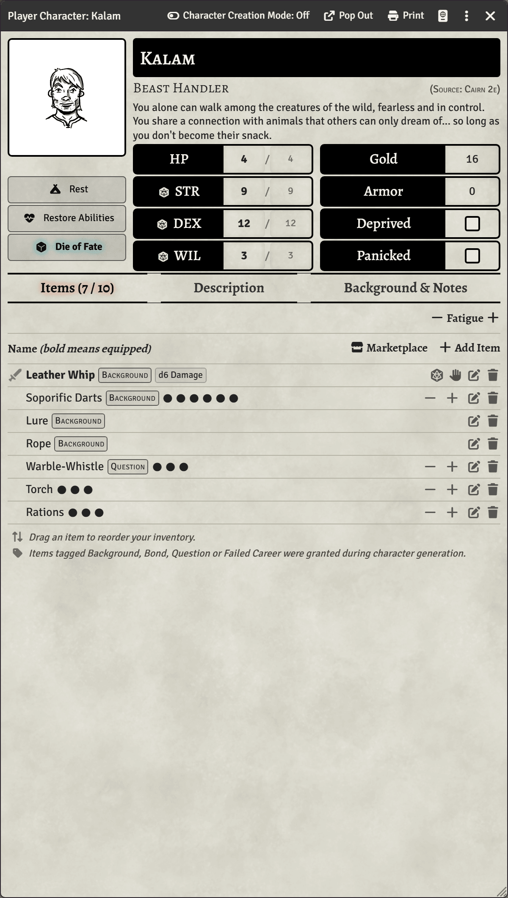
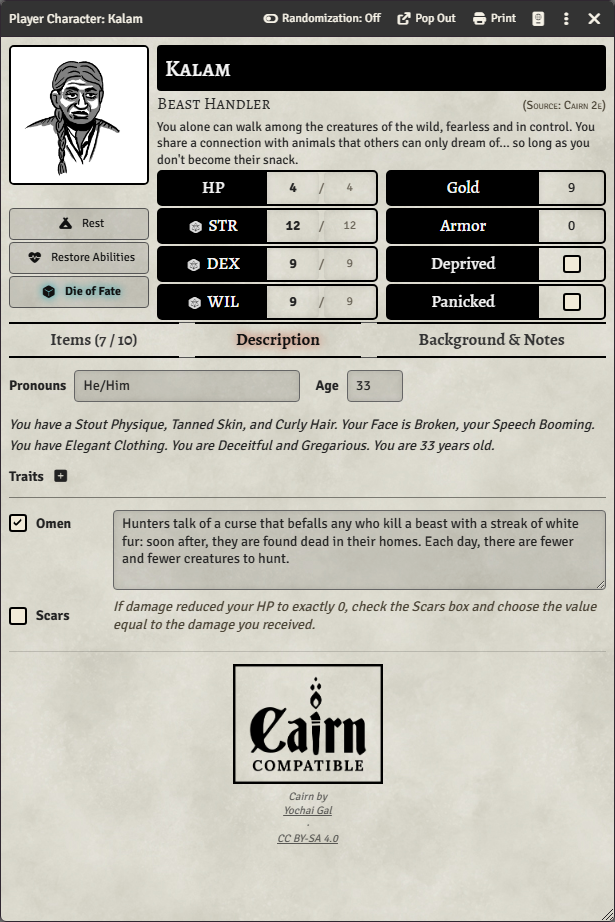
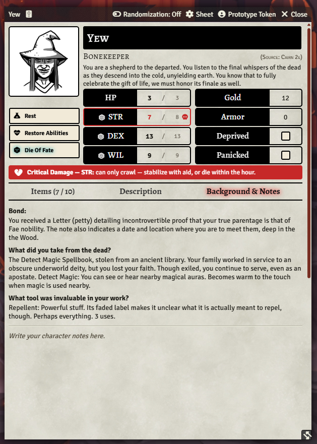
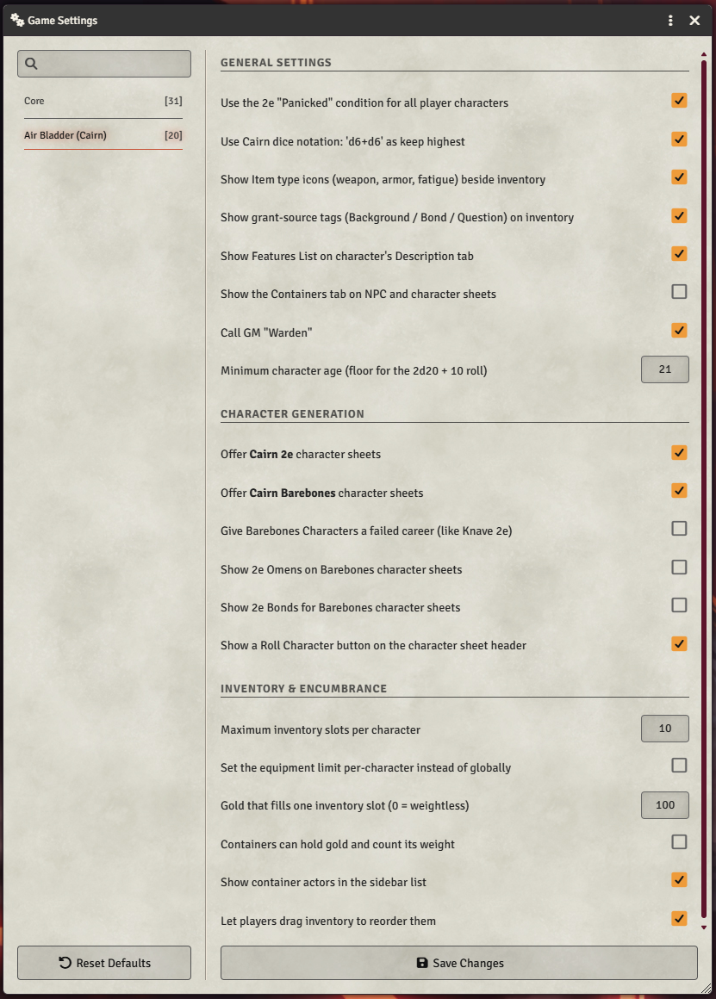

  <picture>
    <source media="(prefers-color-scheme: dark)"  srcset="lydia-comer/Airbladder06.webp">
    <source media="(prefers-color-scheme: light)" srcset="lydia-comer/Airbladder02.webp">
    
  </picture>

[English](README.md) · **Español**

Esta traducción puede estar desactualizada; el README en inglés es la versión de referencia.

<!--
  Traducción al español (Latinoamérica) — BORRADOR.
  Términos por confirmar contra la "Guía del jugador" oficial de Cairn 2e, para
  que coincidan con la traducción dentro del sistema:
    Warden  -> "Custodio"    (provisional)
    hireling -> "asalariado"  (provisional)
  Los nombres propios, ediciones (Cairn 2e, Barebones) y licencias no se traducen.
-->

Un sistema de juego para [Foundry VTT](https://foundryvtt.com) para jugar contenido de **Cairn 2e** y de la **Edición Barebones de Cairn**: trasfondos detallados, algunas opciones que añaden funciones de 2e a las hojas Barebones, y tablas del Custodio de 2e. **Compatible con [Cairn](https://cairnrpg.com) de Yochai Gal.**

## Resumen

Air Bladder es un sistema complementario amigable, no el sistema oficial de Cairn. Desciende de [yochaigal/Cairn-FoundryVTT](https://github.com/yochaigal/Cairn-FoundryVTT) (de Yochai Gal y Oskar Świda), que a su vez desciende del sistema Electric Bastionland y de Into the Odd. *Air Bladder* es el primer objeto de la tabla de Equipo en la p. 17 de la Guía del jugador de Cairn 2e.

## Características principales

- Generación aleatoria o manual de personajes tanto de Cairn 2e como de Cairn Barebones; cada estilo se puede activar o desactivar.
- Las hojas Barebones admiten funciones caseras (homebrew) opcionales.
- Generación aleatoria o manual de hojas de asalariados.
- Ayudas contextuales para jugadores.
- Mercado y contenedores.
- Tablas orientadas al Custodio.
- Una galería de 80 retratos de personaje con licencia CC BY 4.0, de Jon Aspeheim.
- Automatización mínima.

## Capturas de pantalla

<table>
  <tr>
    <td></td>
    <td></td>
    <td></td>
  </tr>
</table>

*La hoja de personaje: pestañas de Objetos, Descripción, y Trasfondo y notas. La franja roja es la condición automática de **Daño Crítico**, que aparece cuando la FUE recibe daño.*

*La configuración de juego del Custodio, agrupada por secciones.*

## Funciones planificadas

- Trasfondos personalizados al estilo 2e configurables por el Custodio (trasfondo, equipo inicial, preguntas, objetos), totalmente compatibles con la generación aleatoria de personajes.

## Estado

Desarrollo temprano y activo. ¡Envía comentarios y arte! El sistema se está reconstruyendo sobre la arquitectura de **compendios editables** del original: el equipo vive en compendios de objetos que el Custodio puede editar en un solo lugar, y la generación de personajes y el mercado hacen referencia a esos compendios por su nombre.

**Traductores bienvenidos** — consulta [docs/TRANSLATING.md](docs/TRANSLATING.md) (en inglés) para ver cómo funciona el proceso de traducción. No hace falta programar.

## Instalación (manual)

**Requiere Foundry VTT v13 o posterior** (verificado en v14).

1. En el menú **Sistemas de juego** de Foundry, haz clic en **Instalar sistema**.
2. Ingresa la URL del manifiesto: `https://github.com/domfortunato/air-bladder/releases/latest/download/system.json`

Para desarrollo, clona este repositorio en `Data/systems/air-bladder` (una unión de directorios / *junction* funciona), ejecuta `npm install` y luego `npm run build:packs` antes de iniciar Foundry. `npm run dev:smoke` realiza una carga sin interfaz (*headless*) como verificación básica.

## Divulgación sobre IA

**El arte generado por IA nunca aparecerá en este repositorio, jamás.** El código, en cambio, se escribió por completo con [Claude Code](https://www.anthropic.com/claude-code), usando como base el repositorio original de Cairn de Yochai Gal.

## Créditos y licencias

Air Bladder combina varios regímenes de licencia; por favor, conserva la atribución intacta:

- **Texto del juego — CC BY-SA 4.0.** Las reglas y el texto de Cairn (1.ª y 2.ª edición) son de **Yochai Gal**, con licencia [CC BY-SA 4.0](https://creativecommons.org/licenses/by-sa/4.0/). El contenido de 2e en este sistema hereda esa licencia; las obras derivadas deben compartirse igual y atribuir a Yochai Gal.
- **Código — MIT.** El código del sistema de Foundry desciende del **Cairn-FoundryVTT** original, de **Yochai Gal y Oskar Świda** (MIT), que a su vez desciende del sistema Electric Bastionland. Consulta `LICENSE.txt`.
- **«Compatible con Cairn»** — la insignia de compatibilidad se usa según los términos de [cairnrpg.com/resources/logos](https://cairnrpg.com/resources/logos) (CC BY-SA 4.0, Yochai Gal).
- **Logo de Air Bladder — © Lydia Comer, todos los derechos reservados.** El logo y el material gráfico relacionado en `lydia-comer/` son de **Lydia Comer**, con licencia para el sistema Air Bladder para su inclusión y redistribución sin modificaciones como parte del sistema y sus bifurcaciones (*forks*); cualquier otro uso requiere permiso. Consulta `lydia-comer/license.txt`.
- **Arte de personajes — CC BY 4.0.** Las 80 imágenes emparejadas de retrato/token en `character_portraits/` y `character_tokens/` son de **Jon Aspeheim**, con licencia [CC BY 4.0](https://creativecommons.org/licenses/by/4.0/) (consulta el `license.txt` en cada carpeta). CC BY simple: la redistribución está permitida y la atribución es obligatoria. Conserva este crédito si el arte se distribuye.
- **Íconos de objetos y contenedores — CC BY 3.0.** Los íconos de clase en `icons/` (equipo, grimorios, transportes, contenedores, monstruos) provienen de [game-icons.net](https://game-icons.net) por **Lorc, Delapouite y Skoll**, con licencia [CC BY 3.0](https://creativecommons.org/licenses/by/3.0/). Los créditos de autor y de la página de origen de cada ícono están en `icons/CREDITS.md`.

---

  

