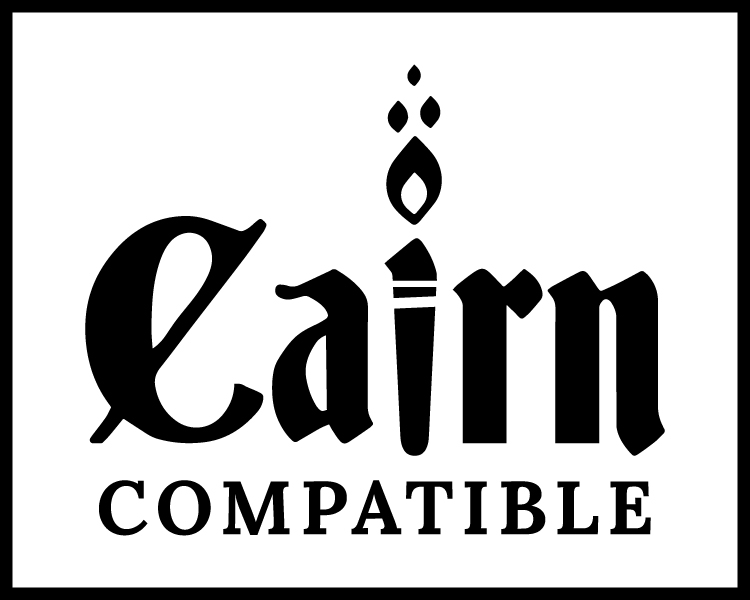

  <picture>
    <source media="(prefers-color-scheme: dark)"  srcset="art/lydia-comer/Airbladder06.webp">
    <source media="(prefers-color-scheme: light)" srcset="art/lydia-comer/Airbladder02.webp">
    
  </picture>

### [Visit the Air Bladder website →](https://domfortunato.github.io/air-bladder/)

**English** · [Español](README.es.md)

Translations may lag; the English README is authoritative.

A [Foundry VTT](https://foundryvtt.com) game system for playing **Cairn 2e** and **Cairn Barebones Edition** content — verbose backgrounds, a few options that add 2e features to Barebones sheets, and 2e Warden tables. **Compatible with [Cairn](https://cairnrpg.com) by Yochai Gal.**

## Summary

Air Bladder is a friendly companion system, not the official Cairn system. It descends from [yochaigal/Cairn-FoundryVTT](https://github.com/yochaigal/Cairn-FoundryVTT) (by Yochai Gal & Oskar Świda), which in turn descends from the Electric Bastionland system and Into the Odd. *Air Bladder* is the first item in the Gear table on p. 17 of the Cairn 2e Player's Guide.

## Key Features

- [Random character generation](https://github.com/domfortunato/air-bladder/blob/master/docs/generating-characters.md) from Cairn 2e, **Custom Cairn 2e**, and Cairn Barebones backgrounds — each source toggles on or off, and the sheet's **Character Creation Mode** re-rolls single parts of the result
- [NPC and Hireling](https://github.com/domfortunato/air-bladder/blob/master/docs/generating-npcs.md), [Monster](https://github.com/domfortunato/air-bladder/blob/master/docs/generating-monsters.md) and [Faction](https://github.com/domfortunato/air-bladder/blob/master/docs/generating-factions.md) generators, [Encounter Tables](https://github.com/domfortunato/air-bladder/blob/master/docs/encounter-tables.md) with one-click Add to Scene, and more Warden-facing roll tables
- .json character import from the official Cairn app, [Kettlewright](https://kettlewright.com/) — for the Warden, and for players bringing in their own characters when the Warden allows (a Warden must be logged in)
- **Optional GLOG Magic** — the official [GLOG hack](https://cairnrpg.com/hacks/glog-magic/) behind a Warden switch: cast from a found Grimoire with 1–4 Magic Dice, the rolled values written into the spell text, Mishaps on doubles — all 100 spells included; [how to run it](https://github.com/domfortunato/air-bladder/blob/master/docs/glog-magic.md)
- Custom 2e backgrounds — seven ship in the **Backgrounds (Custom)** compendium; [create and lint your own](https://github.com/domfortunato/air-bladder/blob/master/docs/creating-custom-backgrounds.md), then [share them across worlds](https://github.com/domfortunato/air-bladder/blob/master/docs/sharing-custom-backgrounds.md)
- Custom bonds — a world table named **Bonds** replaces the shipped 2e table for canon and custom backgrounds alike, and a custom background can name a table of its own; [customizing bonds](https://github.com/domfortunato/air-bladder/blob/master/docs/customizing-bonds.md)
- Pop-out and **printable** character sheets — print the whole character on one or two pages
- [Supplied macros](https://github.com/domfortunato/air-bladder/blob/master/docs/supplied-macros.md) — four Warden switches for the hotbar, no trip into Game Settings
- A Warden-editable **Age formula** — generated ages roll whatever dice you write; the [dice formulas guide](https://github.com/domfortunato/air-bladder/blob/master/docs/dice-formulas.md) covers Cairn's keep-highest plus sign, minimums and maximums, and ready-made recipes
- Three portrait-picker galleries: 80 character portraits by [Jon Aspeheim](https://jonaspeheim.itch.io/), 368 creature & NPC tokens by [tlomdev](https://tlomdev.itch.io/) (an imported Kettlewright character keeps its face), and 17 monsters drawn for Air Bladder by [Lydia Comer](https://linktr.ee/lydiadidmyink)
- Minimal automation — buttons for rest, restoring abilities, panic and critical damage
- Impaired and Enhanced damage rolls — pick one when you roll; a panicked character rolls impaired automatically
- Works with the [Torch](https://github.com/League-of-Foundry-Developers/Torch) module — a ready-made light-source file lights torches, lanterns, candles and the stranger lamps straight from the inventory, spending their uses: [set it up](https://github.com/domfortunato/air-bladder/blob/master/docs/torch-module.md)

## Screenshots

<table>
  <tr>
    <td></td>
    <td></td>
    <td></td>
  </tr>
</table>

*The character sheet — Items, Description, and Background & Notes tabs. Sheets follow your Foundry colour scheme; these are light.*

*In Character Creation Mode: On, you can roll for a new background, name, background questions, gear, etc., or you can pick specific table entries.*

*Print a clean character sheet — stats, inventory, background, bonds and omen on one or two pages, ready for the table.*

Pre-generated Player Characters are also available on <a href="https://domfortunato.itch.io/cairn-2e-pre-gens" target="_blank" rel="noopener">Dom Bosco's Itch Page</a>.

*The Warden's game settings — four submenus, one open — shown here in dark mode.*

## Status

Early, active development. Send feedback and art! The system is being rebuilt on the original's **editable-compendium** architecture — gear lives in Item compendia that a Warden can edit in one place, and character generation and the marketplace reference those packs by name.

## Languages

The interface is translated into **Spanish** (85% of the current strings, by [Malecho](https://github.com/fsmalecho)), and game *content* — backgrounds, items, spells, tables — is translated into Spanish only.

Danish, French, German, Polish and Brazilian Portuguese interface files are inherited from the original Cairn system. They cover **15–30%** of the current interface, predate most of this system's features, and are **not actively maintained** — a game in those languages is mostly English in practice. Anything untranslated falls back to English string by string, so a partial translation is always usable rather than broken.

The tooling is language-agnostic (`--lang <code>` throughout), so a new language needs no code changes — only a translator.

**Translation Help Requested!** — see [docs/TRANSLATING.md](https://github.com/domfortunato/air-bladder/blob/master/docs/TRANSLATING.md) for the no-coding workflow, or [docs/translating-self-service.md](https://github.com/domfortunato/air-bladder/blob/master/docs/translating-self-service.md) if you'd rather work in git.

## Installation (manual)

**Requires Foundry VTT v14.365 or higher.**

1. In the Foundry **Game Systems** menu, click **Install System**.
2. Enter the manifest URL: `https://github.com/domfortunato/air-bladder/releases/latest/download/system.json`

For development, clone this repo into `Data/systems/air-bladder` (a directory junction works), run `npm install`, then `npm run build:packs` before launching Foundry. `npm run dev:smoke` drives a headless load as a sanity check.

To try **unreleased** work, clone the `dev` branch instead — that is where everything in progress lives. The `npm run build:packs` step is required either way: the compendium packs are generated from `src/packs/` and are not stored in git, so an unbuilt clone loads with every compendium empty.

## Contributing

Pull requests welcome — open them against **`dev`**, not `master`. See [CONTRIBUTING.md](https://github.com/domfortunato/air-bladder/blob/master/CONTRIBUTING.md) for the details, and [docs/git-flow.md](https://github.com/domfortunato/air-bladder/blob/master/docs/git-flow.md) for how branches and releases work here.

## AI Disclosure

**Generative-AI art will never appear in this repo — ever.** The code, on the other hand, was written with [Claude Code](https://www.anthropic.com/claude-code), using Yochai Gal's original Cairn repo as a base.

## Credits & licenses

Air Bladder mixes several licensing regimes — please keep the attribution intact:

- **Game text — CC BY-SA 4.0.** The Cairn rules and text (1st and 2nd edition) are by **Yochai Gal**, licensed [CC BY-SA 4.0](https://creativecommons.org/licenses/by-sa/4.0/). 2e content in this system inherits that license; derivatives must share alike and attribute Yochai Gal. That includes the rules text shipped as readable pages: the **Cairn 2e Rules** compendium holds "Overview & Principles" and "Core Rules for Players", transcribed from the 2e text, and the **Vald** compendium holds the Warden's Guide setting chapter of the same name, fetched from the Cairn SRD.
- **Spanish translation — CC BY-SA 4.0.** The Castilian Spanish (es-ES) translation is by **[Malecho](https://github.com/fsmalecho)** — `lang/es.json` (interface) and `lang/content/es.json` (game content). As a derivative of the CC BY-SA game text, the translation is likewise licensed [CC BY-SA 4.0](https://creativecommons.org/licenses/by-sa/4.0/).
- **"Backgrounds for Cairn" — CC BY-SA 4.0 (text).** The seven class backgrounds in the Custom compendium (Fighter, Cleric, Magic-User, Thief, Dwarf, Elf, Halfling) are from **Backgrounds for Cairn** by **Gordon McCormick**, based on Cairn by Yochai Gal and BECMI D&D by Frank Mentzer, text licensed [CC BY-SA 4.0](https://creativecommons.org/licenses/by-sa/4.0/). Text only — the booklet's art (by Perplexing Ruins and Jeff Koch) is not included.
- **GLOG Magic — CC BY-SA 4.0.** The 100 spells in the GLOG Spellscrolls compendium are the [GLOG Spells](https://cairnrpg.com/hacks/glog-spells/) list from the official Cairn [GLOG Magic](https://cairnrpg.com/hacks/glog-magic/) hack on cairnrpg.com, licensed [CC BY-SA 4.0](https://creativecommons.org/licenses/by-sa/4.0/) as stated on those pages. The Mishaps table in Tables (GLOG) and both journals in Journals (GLOG) — "GLOG Magic — Player Rules" and "GLOG Magic — Spells" — are the same hack's text under the same licence. The text is transcribed verbatim; `[dice]` and `[sum]` are the hack's own casting variables and stay prose. The in-system cast flow adopts its resolved-text design — the per-power blocks and the `[dice]`/`[sum]` substitution — from a casting macro by **[Malecho](https://github.com/fsmalecho)**, who proved the idea against this spell list before the system had a cast button.
- **Code — MIT.** The Foundry system code descends from the original **Cairn-FoundryVTT by Yochai Gal & Oskar Świda** (MIT), itself descended from the Electric Bastionland system. See `LICENSE.txt`. The same MIT grant covers the interface strings in `lang/`: the Danish, French, German, Polish and Brazilian Portuguese files are inherited from Cairn-FoundryVTT and travel under its licence. The four shipped Warden macros (the `macros` compendium) are original JavaScript under the same MIT licence — the CC BY-SA clause covers Cairn's text, which the macros contain none of. The **System Docs** journals travel here too: they are this project's own Warden guides, generated from `docs/`, and reproduce no Cairn text.
- **"For Use With Cairn"** — the compatibility marks in `logo/` are used per the terms on [cairnrpg.com/resources/logos](https://cairnrpg.com/resources/logos) (CC BY-SA 4.0, Yochai Gal), unmodified. The character sheet and the printed page both show the "For Use With Cairn" stamp; the older "Compatible with Cairn 2e" badge it replaced is kept beside it. Details in `logo/README.md`.
- **Air Bladder logo and monster art — © Lydia Comer, all rights reserved.** Everything in `art/lydia-comer/` is by **[Lydia Comer](https://linktr.ee/lydiadidmyink)**, licensed to the Air Bladder system for inclusion and redistribution as part of the system and its forks, and for use representing and promoting the project; any use outside the Air Bladder project requires permission. Two jobs under one grant: the logo files at the top of the folder, and — in `art/lydia-comer/portraits/` and `art/lydia-comer/tokens/` — 17 creatures drawn for this system, offered in the portrait picker's **Lydia Comer** gallery on NPC and Monster sheets, each a square portrait paired with the circle-cropped token drawn from it. **This is not a Creative Commons licence**, unlike every other art regime here: nothing may be used separately from Air Bladder. Contents are listed in `art/lydia-comer/CREDITS.md`; the full terms are in `art/lydia-comer/license.txt`.
- **Character art — CC BY 4.0.** The 80 paired portrait/token images in `art/jon-aspeheim/portraits/` and `art/jon-aspeheim/tokens/` are by **[Jon Aspeheim](https://jonaspeheim.itch.io/)** (source: [Lemur's Portraits](https://jonaspeheim.itch.io/lemurs-portraits)), licensed [CC BY 4.0](https://creativecommons.org/licenses/by/4.0/) (see `art/jon-aspeheim/license.txt`, which covers both subfolders). Plain CC BY: redistribution is fine, attribution is required. The artist states these portraits were created without AI. **Modified: the source ships 1000×1000 PNG portraits and no tokens — the `portraits/` half is re-encoded to WebP at the same size, and the `tokens/` half is cropped and downscaled from them to 256×256 for the canvas** — the indication CC BY 4.0 §3(a)(1)(B) requires. Keep this credit if the art ships.
- **game-icons.net art — CC BY 3.0.** Two folders, one grant, both from [game-icons.net](https://game-icons.net) and licensed [CC BY 3.0](https://creativecommons.org/licenses/by/3.0/). `icons/` holds the class icons (gear, spellbooks, transports, containers, monsters) by **Lorc, Delapouite, Skoll & SeregaCthtuf**; `art/game-icons/` holds the **Game-Icons** picker gallery — 2,275 glyphs in 38 categories by **Andy Meneely, Aussiesim, Carl Olsen, Caro Asercion, Cathelineau, DarkZaitzev, Delapouite, Faithtoken, GeneralAce135, Guard13007, Irongamer, Lorc, Lord Berandas, Lucas, Quoting, Rihlsul, Sbed, SeregaCthtuf, Skoll, Sparker, Starseeker, Willdabeast** and one icon credited to various artists. Per-icon author and source-page credits are recorded in `icons/CREDITS.md` and `art/game-icons/CREDITS.md`; those files are the attribution, since the shipped path records only the category. The upstream notice ships verbatim as `art/game-icons/license.txt`.
- **Tlomdev's Tokens — CC BY-SA 4.0.** The 368 black-and-white token drawings in `art/tlomdev/` are by **[tlomdev](https://tlomdev.itch.io/)** (source: [Tlomdev's Tokens](https://tlomdev.itch.io/tlomdevs-tokens)), licensed [CC BY-SA 4.0](https://creativecommons.org/licenses/by-sa/4.0/). **Modified: re-encoded from PNG to WebP (quality 95) and changed in no other way** — the full modification notice CC BY-SA §3(a)(1)(B) requires is the Modifications section of `art/tlomdev/CREDITS.md`. They appear in the portrait picker's **Tlomdev** gallery under the artist's own category folders. The `kettlewright-portraits/` subfolder (the picker labels it “Kettlewright Portraits”) carries the same artist's drawings as shipped by [Kettlewright](https://github.com/yochaigal/kettlewright), with Kettlewright's exact filenames, so an imported Kettlewright character keeps the portrait its player chose. ShareAlike: adaptations of the art must carry the same licence. Attribution and provenance are recorded in `art/tlomdev/CREDITS.md`; the notice ships as `art/tlomdev/license.txt`.
- **Alegreya typeface — SIL Open Font License 1.1.** The three webfonts in `fonts/` are **Alegreya** by Juan Pablo del Peral and the Alegreya Project Authors ([Huerta Tipográfica](https://github.com/huertatipografica/Alegreya)), © 2011, licensed [OFL 1.1](https://openfontlicense.org/). **Modified: converted to WOFF2 for web delivery and changed in no other way** — the OFL counts a format change as a Modified Version (§1), so this is not an unmodified redistribution. Nothing is breached by that: Alegreya declares no Reserved Font Name, so the name stays usable, and the licence requires its notice travel with every copy, so `fonts/OFL.txt` and `fonts/license.txt` ship with them.

**And a thank-you, not a licence: [Kettlewright](https://kettlewright.com/)**, Yochai Gal's official Cairn app. The printable character sheet's layout is modelled on Kettlewright's print page, and the `.json` character import exists so a Kettlewright character can walk straight in. Inspiration and interoperability — no Kettlewright code or assets ship here beyond what the Tlomdev entry above records.

---

  

